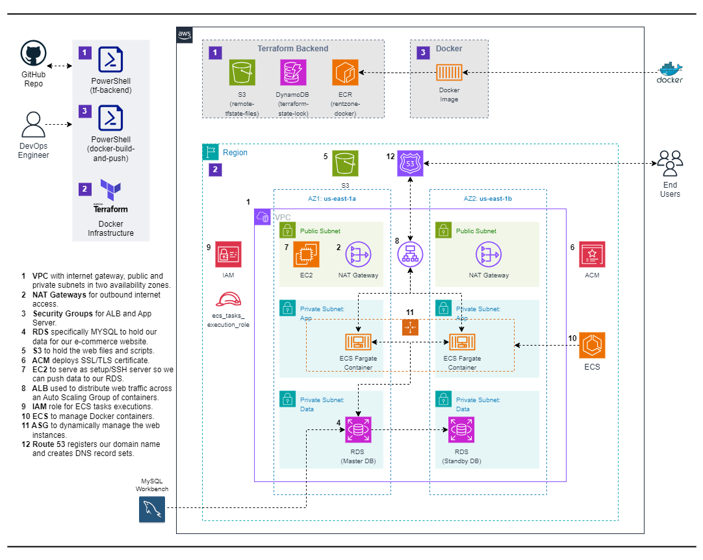

# Host a Dynamic Car Rental Website on AWS using Docker, Amazon ECR, and ECS with Terraform

## Overview

This project demonstrates how to deploy a dynamic website on Amazon Web Services (AWS) using Docker, Amazon ECR (Elastic Container Registry), and ECS (Elastic Container Service). The automation tools used are Terraform and PowerShell. The setup includes the following components: VPC, RDS, S3, ACM, EC2, ALB, IAM, ECS, ASG and R53.

## Reference Diagram

## Project Components

1. **VPC**: Virtual Private Cloud with internet gateway, public and private subnets in two availability zones.
2. **NAT Gateways**: For outbound internet access.
3. **Security Groups**: For ALB and App Server.
4. **RDS**: To hold our data for our website
5. **S3**: To hold the web files and scripts.
6. **ACM**: AWS Certificate Manager to deploy SSL/TLS certificate.
7. **EC2**: To serve as setup/ssh server so we can push data to our RDS.
8. **ALB**: Application Load Balancer used to distribute web traffic across an Auto Scaling Group of containers.
9. **IAM**: Role for ECS tasks executions.
10. **ECS**: Elastic Container Service for running Docker containers.
11. **ASG**: Auto Scaling Group to dynamically manage EC2 web instances.
12. **Route 53**: Registers our domain name and creates DNS record sets.

## Prerequisites

Before you begin, ensure you have the following:

- An AWS account with appropriate permissions.
- Terraform installed on your local machine.

### Notes

- Ensure that you have the necessary AWS credentials configured on your system for Terraform to authenticate with AWS.
- Review the Terraform configuration files to understand the resource provisioning process.
- Refer to the official Terraform documentation for more information on configuring AWS resources using Terraform.

## Deployment Steps

1. **Clone Repository**: Clone the repository to your local machine.
2. **Configure Terraform**: Update necessary variables in the Terraform configuration files.
3. **Initialize Terraform**: Run `terraform init` to initialize the working directory.
4. **Create Resources**: Run `terraform apply` to create AWS resources.
5. **Test Website**: Access the provided website URL to verify the functionality of the website.
6. **Cleanup**: After testing, it's important to clean up resources to avoid unnecessary charges. Execute `terraform destroy` to remove all resources provisioned by Terraform.

## Resources

- [Terraform Documentation](https://www.terraform.io/docs/index.html)
- [Docker Documentation](https://docs.docker.com/get-started/)

## Additional Notes

- Customize Terraform scripts and configurations as needed for your specific requirements.
- Ensure proper IAM permissions and security measures are in place for managing AWS resources securely.

---

This README provides a structured overview of the project, outlines the necessary components, prerequisites, and steps to deploy and manage a dynamic website on AWS with Docker using Terraform.